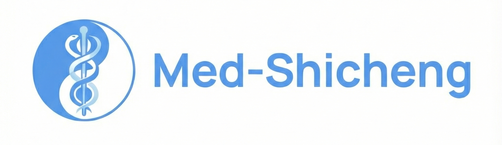

<div align="center">
  
</div>

<div align="center">

[](https://njucm-bjucm-tcm-ai.github.io/Med-Shicheng_project_website/)
[](https://huggingface.co/MightyAntsGoesUp/Med-Shicheng-1.5B-Base)
[](#)
[](LICENSE)

</div>


---

<div align="center">
From Physician Expertise to Clinical Agents: Preserving, Standardizing, and Scaling Physicians' Medical Expertise with Lightweight LLM
</div>

---

## Table of Contents

1. [Introduction](#1-introduction)  
2. [Model Summary](#2-model-summary)  
3. [Model Downloads](#3-model-downloads)  
4. [Evaluation Results](#4-evaluation-results)  
5. [Project Website & Model Hub](#5-project-website--model-hub)  
6. [System Requirements](#6-system-requirements)  
7. [License](#7-license)  
8. [Citation](#8-citation)  
9. [Contact](#9-contact)  

---

## 1. Introduction

Medicine, whether framed in traditional systems or modern biomedicine, is essentially an empirical knowledge system accumulated through long-term observation, validation, and refinement, and ultimately tested in complex, high-variance real-world clinical practice. Physicians’ diagnostic-and-therapeutic competence is forged through repeated cycles of **application → reflection → re-learning**, gradually crystallizing into individualized, highly structured methodologies.

However, the formation of master physicians’ knowledge systems is **time-consuming** and their transmission is often **narrow in scope**, leading to:

- substantial variation in treatment outcomes,  
- difficulty in scaling and disseminating high-quality clinical expertise,  
- and persistent scarcity of advanced clinical resources.

To address these challenges, we propose **Med-Shicheng**, a general framework that enables a lightweight large language model to systematically learn and transfer **distinguished TCM physicians’ diagnostic-and-therapeutic philosophy** and **case-dependent adaptation rules** in a standardized way. Implemented on **Qwen2.5-1.5B-Base**, Med-Shicheng:

- internalizes the clinical logic and personal styles of **five National Masters / distinguished TCM physicians**,  
- handles the full chain from **etiology–pathogenesis** analysis to **prescription and follow-up adjustment**,  
- and can be deployed on **resource-constrained GPUs**, while achieving **performance comparable to large frontier models such as DeepSeek-R1 and GPT-5** in our evaluation settings.

**Key highlight:** Med-Shicheng achieves **SOTA performance in multi-master personalized TCM**, standing out as the **only lightweight model** in the top tier while competing with hundred-billion-parameter general LLMs.

---

## 2. Model Summary

### 2.1 Base Model & Tokenizer

Med-Shicheng is built on top of the open-source base model **Qwen2.5-1.5B-Base**, and we release a **Med-Shicheng–style base model** on Hugging Face:

- We design and train a **TCM-specialized tokenizer** to better capture domain-specific terminology (classical Chinese, syndrome patterns, formula names, decoction variants, etc.), and integrate it into the 1.5B backbone.  
- We perform **continued pre-training (CPT)** on approximately **1.5 million TCM samples** (clinical cases, textbooks, treatises, teaching materials, etc.), adapting the base model into a **TCM in-domain foundation**.

The released weights are thus **not just vanilla Qwen2.5-1.5B-Base**, but a **TCM-augmented base model** with:

- a **custom TCM tokenizer**, and  
- **CPT on ~1.5M TCM samples**.

### 2.2 Med-Shicheng Five-Stage Framework

Med-Shicheng adopts a five-stage paradigm that progressively injects TCM general knowledge, reasoning, and **master-specific styles** into a single lightweight LLM:

1. **Medical in-domain foundation model construction**  
   - Dataset: **TCMCorpus Dataset**  
   - Goal: adapt the base model to TCM language, concepts, and classical-modern mixed corpora.

2. **TCM regular D&T strategy learning**  
   - Dataset: **TCM-General-Instructions Dataset**  
   - Goal: learn canonical diagnostic-and-therapeutic (D&T) logic aligning with standard TCM education and guidelines.

3. **Reasoning-based D&T reinforced fine-tuning**  
   - Dataset: **TCM-Reasoning Dataset**  
   - Goal: strengthen step-by-step reasoning over full clinical cases, exposing the model’s internal “thinking process” for transparent decision-making.

4. **Unique medical knowledge fine-tuning (per master)**  
   - Dataset: **TCM-Unique-Instruction Dataset**  
   - Goal: inject each distinguished physician’s *idiosyncratic* knowledge system and preferred patterns of syndrome differentiation and formula design.

5. **Reasoning-based unique D&T strategy reinforced learning**  
   - Dataset: **TCM-Unique-Reasoning Dataset**  
   - Goal: refine **master-specific reasoning chains** and treatment adjustment strategies under diverse case evolutions.

This staged design turns a general-purpose LLM into a **doctor-aware medical agent** that can:

- internalize multiple masters’ styles in **one model**, and  
- **switch behaviors** according to the target physician.

### 2.3 Supported Tasks

Med-Shicheng jointly handles **multi-step, structured TCM clinical reasoning** across the following tasks:

1. Thinking and reasoning process over a patient’s clinical case  
2. TCM knowledge–based **etiology & pathogenesis analysis**  
3. **Syndrome diagnosis**
4. Analysis and determination of **treatment principles** 
5. **Prescription generation** (including formula composition)  
6. **Prescription explanation** (rationale, key herbs, compatibility)  
7. Predicting **symptom evolution** and corresponding **herbal modifications**  
8. Providing structured **clinical advice**  

---

## 3. Model Downloads

The main release is hosted on Hugging Face as a gated but openly available model (license: MIT):

| Model | Details | Download |
|-------|---------|----------|
| **Med-Shicheng-Base** | Base: Qwen2.5-1.5B-Base<br>Params: 1.5B<br>Type: TCM-domain CPT + custom tokenizer | 🤗 [Hugging Face](https://huggingface.co/MightyAntsGoesUp/Med-Shicheng-1.5B-Base) |

> **Note:**  
> Access to the Hugging Face repo is **request-based**. Once access is granted, you can directly download and run the Med-Shicheng base model locally.

---

## 4. Evaluation Results

### 4.1 Med-Shicheng Framework

<div align="center">
  
</div>

Our **TCM heritage framework** combines staged data curation with multi-task learning, enabling a single lightweight model to internalize multiple masters’ D&T systems and switch behavior per target physician.

### 4.2 Automatic Evaluation (LLM-as-a-Judge)

<div align="center">
  
</div>

We build an evaluation pipeline that uses **state-of-the-art general LLMs** as judges. Each model’s response to a clinical case is scored twice, once by each judge, who compare the generated answer with the gold label and decide how clinically desirable it is.

Key observations:

- Models form **two performance tiers**.  
- The **top tier** includes: **Med-Shicheng, GPT-5, DeepSeek-R1, Qwen3-235B-A22B-Thinking, Gemini-2.5-Pro**.  
- **Med-Shicheng is the only lightweight model** in this tier, showing competitive clinical quality despite its small parameter count.

### 4.3 Human Doctor Evaluation

<div align="center">
  
</div>

We conduct human evaluation with **18 senior TCM physicians**, organized around the five target masters with whom they have direct lineage. Using Delphi-style consensus and unified rubrics, they rate models along five dimensions:

1. Similarity to the target master’s D&T style  
2. Consistency with TCM philosophical principles  
3. Safety and risk control  
4. Therapeutic completeness  
5. Clinical coherence  

Findings:

- Human doctors tend to assign **Med-Shicheng higher and more stable scores** for most masters.  
- LLM judges sometimes **underestimate** Med-Shicheng on fine-grained, individualized style, even when physicians rank it near the top.  
- This suggests that while large general LLMs can approximate clinical desirability, **human experts remain indispensable** for nuanced, style-sensitive evaluation.

---

## 5. Project Website & Model Hub

-  **Project Website (full framework, figures & updates)**  

  The website provides:
  - Abstract, motivation, and framework illustrations  
  - Details of evaluation design (LLM-as-judge + human doctors)  
  - Additional context about related works (e.g., Tianyi) and our TCM-AI roadmap  

- 🤗 **Hugging Face Model Hub (Med-Shicheng base model)**  
 
  On Hugging Face, we release the **Med-Shicheng domain-adapted base model** (Qwen2.5-1.5B-Base + TCM tokenizer + CPT on ~1.5M samples), enabling the community to:

  - perform further **instruction tuning**,  
  - build **downstream clinical agents**, or  
  - integrate Med-Shicheng into larger TCM-AI systems.

---

## 6. System Requirements

Med-Shicheng is fully supported by recent versions of the Hugging Face `transformers` library.  
**We strongly recommend using the latest `transformers` release.**

When using `transformers < 4.37.0`, you may encounter an error similar to:

KeyError: 'qwen2'

---

## 7. License

The model weights hosted at Hugging Face (MightyAntsGoesUp/Med-Shicheng-1.5B-Base) are licensed under Research-Only as indicated on the model card.

---

## 8. Citation

If you find Med-Shicheng useful in your research or applications, please consider citing our work:

```bibtex
@article{medshicheng2026,
  title={Med-Shicheng:From Physician Expertise to Clinical Agents: Preserving, Standardizing, and Scaling Physicians' Medical Expertise with Lightweight LLM},
  author={First Author and Second Author and Third Author},
  year={2026},
  eprint={COMING SOON},
  archivePrefix={arXiv},
  primaryClass={cs.CL},
  url={arXiv:COMING\_SOON},
}

---

## 9. Contact

For questions, feedback, or collaboration:

- **GitHub Issues:** please open an issue in this repository.  
- **Project Website:** see the footer section of the project page for up-to-date maintainer information and email addresses.
- **Email:** you can also reach our team at [jdai27@jh.edu](mailto:jdai27@jh.edu).

---
